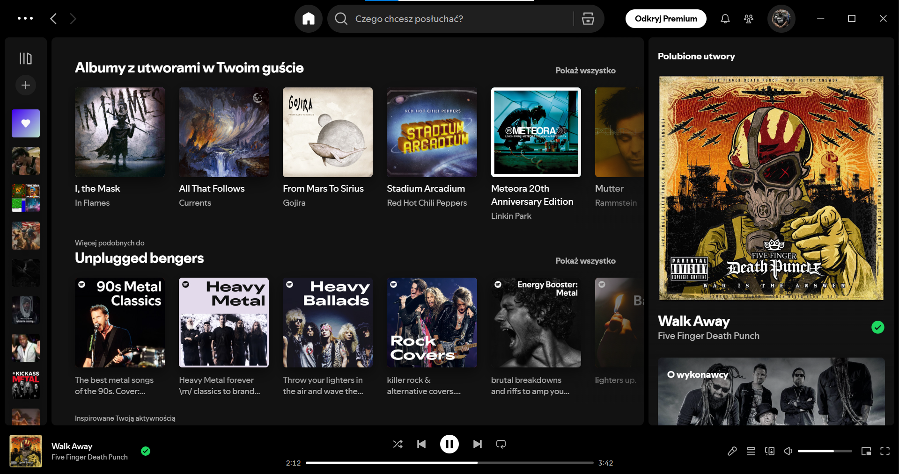

<div align="center">

  

  # Spotify Ads Skipper
  
  
  **Your music, uninterrupted. Seamless host-based ad blocking.**
  
  
  
   
</div>

> [!TIP]
> **Project Website:** [spotify-skipper-web.vercel.app](https://spotify-skipper-web.vercel.app/)

---

## 📖 About The Project

**Spotify Ads Skipper** is a powerful yet lightweight utility for Windows that **completely blocks ads** in the Spotify desktop application.

**New Version (Host Isolation):**
Unlike the previous version that restarted Spotify, this new version uses **Host Blocking**. It modifies your system's `hosts` file to redirect ad server requests to `0.0.0.0`. This means ads simply fail to load, and your music continues without any interruptions, silence, or restarts.

<br><br>
<div align="center">
  
</div>
<br><br>

### ✨ Key Features

* ⛔ **Host Blocking:** Blocks ads at the network level by preventing connection to ad servers.
* 🎧 **Seamless Experience:** **No restarts**, no muting, no interruptions. Just continuous music.
* 💾 **All-in-One:** Single `.exe` file with embedded block list and icon.
* 🛡️ **Safe & Clean:** Automatically restores your system's default `hosts` file when you close the app.
* ⚡ **Invisible Operation:** Runs silently in the system tray.

---

## 📥 Installation & Usage

### Method 1: The Easy Way (Exe File)

1.  Open the `dist` folder.
2.  You will find `Spotify-Ads-Skipper.exe`
3.  **Run as Administrator:** The app needs permissions to update the `hosts` file.
4.  **Done:** The app runs in the background (check the cat icon in your system tray).
5.  **Auto-Start (Optional):**
    *   Run `autostart_windows.bat`
    *   This will automatically add the program to your Windows Startup.

### Method 2: For Developers (Source Code)

If you want to run it from Python or modify the code:

1.  Clone the repository:
    ```bash
    git clone https://github.com/DEV-industry/Spotify-Ads-Skipper.git
    ```
2.  Install dependencies (standard library only for newest version, but `pystray` and `Pillow` are needed for the tray icon):
    ```bash
    pip install pystray Pillow
    ```
3.  Run the script:
    ```bash
    python SpotifyAdRemover/Spotify.py
    ```

---

## 📂 File Structure

```text
Spotify-Ads-Skipper/
├── dist/
│   ├── Spotify-Ads-Skipper.exe  # All-in-One compiled application
│   ├── autostart_windows.bat    # Auto-start helper
│   └── autostart_windows.ps1    # Auto-start script
├── SpotifyAdRemover/
│   ├── Spotify.py               # Main source code
│   └── ad_hosts.txt             # The block list (source)
└── README.md                    # This file
```

---

## ⚠️ Disclaimer

This project was created for educational purposes to demonstrate network traffic control using the Windows `hosts` file modification.

The author does not encourage blocking ads on services you enjoy. If you love Spotify, please consider purchasing Premium to support the artists.

---
<div align="center">
  Made with ❤️ and 🐱 ~ DEV
</div>
