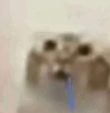

<div align="center">

  

  # Spotify Ads Skipper
  
  **Your music, uninterrupted. Lightweight, fast, and invisible.**
  
  
  
   
</div>

---

## 📖 About The Project

**Spotify Ads Skipper** is a smart background utility for Windows that automatically detects and skips ads in the Spotify desktop application.

Unlike complex blockers that inject code, this tool works on a simple yet effective principle: analyzing the window title. When an ad is detected, it instantly restarts Spotify in a minimized state and forces the next track to play, ensuring your music keeps flowing without interruption.

### ✨ Key Features

* 🚀 **Invisible Operation:** Runs silently in the background without cluttering your taskbar.
* 🧠 **Smart Detection:** Identifies ads by checking for a missing hyphen in the window title.
* 🔇 **Silent Restart:** Restarts Spotify minimized (without stealing window focus).
* ⏭️ **Auto-Next:** Automatically simulates a "Next Track" key press after restart to resume music immediately.

---

## 📥 Installation & Usage

### Method 1: The Easy Way (Exe File)

1.  Download `Spotify-Ads-Skipper.exe`.
2.  Place it in a folder of your choice (e.g., Documents).
3.  **Enable Auto-Start:**
    * Download the `autostart_windows.ps1` script and place it in the **same folder** as the `.exe`.
    * Right-click `autostart_windows.ps1` and select **"Run with PowerShell"**.
    * Done! A shortcut has been added to your Windows Startup folder.

### Method 2: For Developers (Source Code)

If you want to run it from Python or modify the code:

1.  Clone the repository:
    ```bash
    git clone [https://github.com/DEV-industry/Spotify-Ads-Skipper.git](https://github.com/DEV-industry/Spotify-Ads-Skipper.git)
    ```
2.  Install required libraries:
    ```bash
    pip install psutil pywin32
    ```
3.  Run the script:
    ```bash
    python Spotify.py
    ```

---

## 📂 File Structure

```text
Spotify-Ads-Skipper/
├── dist/
│   └── Spotify-Ads-Skipper.exe  # Compiled application
├── cat.ico                      # Our awesome logo
├── autostart_windows.ps1        # Auto-start installation script
├── Spotify.py                   # Main source code
└── README.md                    # This file
