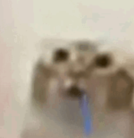
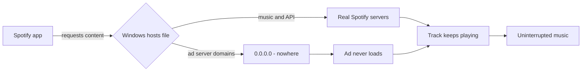
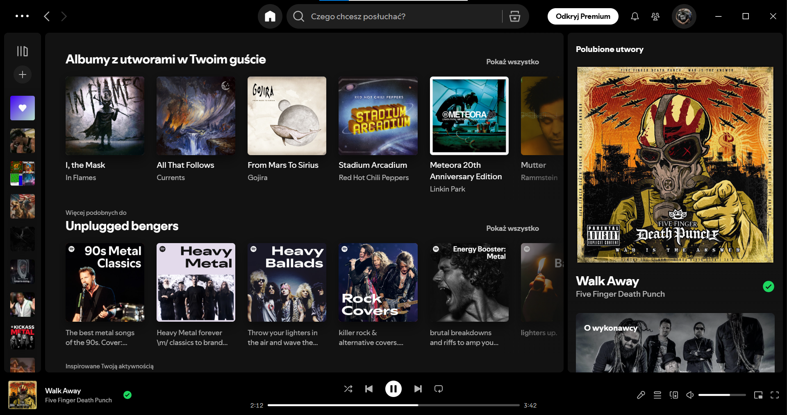

<div align="center">
  

  # Spotify Ads Skipper

  **Your music, uninterrupted. Seamless host-based ad blocking for Windows.**

  <p>
    
    
    
    
    
  </p>

  <p>
    
    
    
    
  </p>

  <a href="https://github.com/DEV-industry/Spotify-Ads-Skipper/releases/latest">
    
  </a>
  &nbsp;
  <a href="https://spotify-skipper-web.vercel.app/">
    
  </a>
</div>

> [!TIP]
> **Project website:** [spotify-skipper-web.vercel.app](https://spotify-skipper-web.vercel.app/) - one-click download, feature tour and setup guide.

---

## Contents

- [What it does](#what-it-does)
- [How it works](#how-it-works)
- [Features](#features)
- [Screenshots](#screenshots)
- [Installation](#installation)
- [Project structure](#project-structure)
- [FAQ](#faq)
- [Disclaimer](#disclaimer)

---

## What it does

**Spotify Ads Skipper** is a lightweight Windows utility that **completely blocks ads** in the Spotify desktop app.

Instead of muting ads or restarting the client the way older tools do, this version uses **host-based blocking**. It adds Spotify's ad servers to your Windows `hosts` file and points them at `0.0.0.0`, so ad requests never reach the network. The ads simply fail to load and your music keeps playing - no silence, no interruptions, no restarts.

The whole thing is a single `.exe` that lives in your system tray and cleans up after itself when you close it.

---

## How it works


```mermaid
flowchart LR
    A[Spotify app] -->|requests content| B{Windows hosts file}
    B -->|ad server domains| C[0.0.0.0 - nowhere]
    B -->|music and API| D[Real Spotify servers]
    C --> E[Ad never loads]
    D --> F[Track keeps playing]
    E --> F
    F --> G[Uninterrupted music]
```

1. On launch, the app requests administrator rights (needed to edit the `hosts` file).
2. It writes a block list of Spotify ad domains between two clearly marked comment lines.
3. It flushes the DNS cache so the change takes effect immediately.
4. When you close it from the tray, it removes that block and restores your original `hosts` file.

Nothing is changed outside those marked lines, and nothing is left behind after you quit.

---

## Features

| Feature | What it means |
| :-- | :-- |
| **Host blocking** | Ads are blocked at the network level - the ad servers are redirected to `0.0.0.0`, so they never load. |
| **Seamless** | No restarts, no muting, no silence gaps. Your queue just keeps flowing. |
| **All in one** | A single `.exe` with the block list and tray icon embedded. |
| **Safe and clean** | Your original `hosts` file is backed up and restored automatically when you exit. |
| **Invisible** | Runs silently in the system tray using almost no resources. |

---

## Screenshots

<div align="center">
  
  <br />
  <em>Spotify running with ads blocked - the music never stops.</em>
</div>

---

## Installation

### Method 1: the easy way (installer)

1. Download `SpotifyAdsSkipper_Setup.exe` from the [latest release](https://github.com/DEV-industry/Spotify-Ads-Skipper/releases/latest).
2. Run the installer and follow the on-screen steps (it installs to Program Files and adds a Desktop shortcut).
3. Launch it. The app starts blocking ads right away and runs quietly in the tray.

That is all. Open Spotify and enjoy.

<details>
<summary><b>Method 2: run from source (for developers)</b></summary>

<br />

If you want to run it from Python or modify the code:

```bash
# 1. Clone the repository
git clone https://github.com/DEV-industry/Spotify-Ads-Skipper.git
cd Spotify-Ads-Skipper

# 2. Install the tray-icon dependencies
pip install pystray Pillow

# 3. Run the script (it will ask for admin rights)
python SpotifyAdRemover/Spotify.py
```

The core logic uses only the Python standard library. `pystray` and `Pillow` are required only for the system-tray icon.

To remove the block manually without opening the app, run:

```bash
python SpotifyAdRemover/Spotify.py --cleanup
```

</details>

---

## Project structure

```text
Spotify-Ads-Skipper/
├── SpotifyAdRemover/
│   ├── Spotify.py        # Main source code (tray app + hosts logic)
│   ├── Spotify.spec      # PyInstaller build spec
│   ├── ad_hosts.txt      # The ad-server block list
│   └── cat.ico           # Tray icon
├── photos/               # README images
├── installer.iss         # Inno Setup installer script
├── LICENSE               # MIT
└── README.md             # This file
```

---

## FAQ

<details>
<summary><b>Why does it need administrator rights?</b></summary>

<br />

The Windows `hosts` file lives in a protected system folder (`C:\Windows\System32\drivers\etc\`). Editing it requires elevated permissions. The app only touches the block it adds between its own markers and never modifies anything else.

</details>

<details>
<summary><b>Is it safe? What happens when I close it?</b></summary>

<br />

Yes. Everything the app writes is wrapped in clearly labelled start and end markers. When you quit from the tray (or run it with `--cleanup`), it removes exactly that block and restores your `hosts` file to its original state, then flushes DNS.

</details>

<details>
<summary><b>Does it modify Spotify itself?</b></summary>

<br />

No. It never patches, injects into, or restarts the Spotify client. It only changes how ad-server domains resolve on your machine, so the ads fail to load.

</details>

<details>
<summary><b>Ads still show up. What do I do?</b></summary>

<br />

Spotify occasionally rotates its ad domains. Grab the latest release, which ships with an updated block list. If you spot a domain that is not covered, open an issue and it can be added.

</details>

---

## Disclaimer

This project was created for educational purposes, to demonstrate network traffic control through Windows `hosts` file modification.

The author does not encourage blocking ads on services you enjoy. If you love Spotify, please consider Premium to support the artists who make the music.

---

## Star history

If this tool saved your ears, consider leaving a star - it genuinely helps other people find the project.

<div align="center">
  <a href="https://star-history.com/#DEV-industry/Spotify-Ads-Skipper&Date">
    
  </a>
</div>

---

<div align="center">
  Built and maintained by DEV. Licensed under MIT.
</div>
