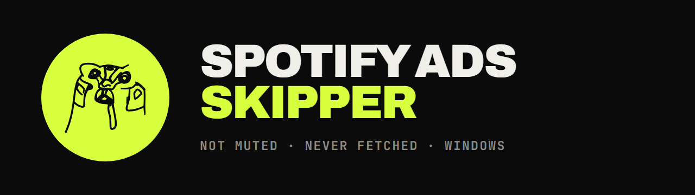
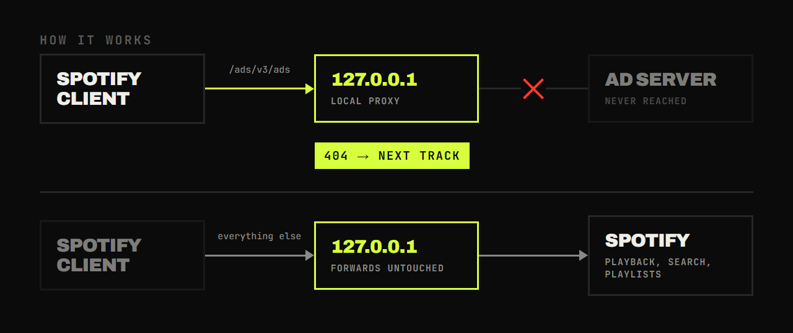

<div align="center">



<p>
  
  
  
  
  
</p>

<a href="https://github.com/DEV-industry/Spotify-Ads-Skipper/releases/latest">
  
</a>
&nbsp;
<a href="https://spotify-skipper-web.vercel.app/">
  
</a>

</div>

https://github.com/user-attachments/assets/868c0282-92ce-4c17-bf4f-5e61006268f4

---

## What it does

A tray utility for Windows that stops Spotify's ads from being delivered at
all. Two kinds of advertising arrive over two different paths, so there are two
mechanisms — both always on, neither optional:

| Ad type | What happens |
| :-- | :-- |
| **Audio** — the spoken ads between tracks | **Never played.** The request is answered with a 404 and the client moves straight to the next track |
| **Display** — home banners, takeovers, video overlays | **Removed** from the client's UI bundle |

There is no "mute the ad instead" mode. Silencing an ad still costs you the
thirty seconds; this does not. It needs no administrator rights, and touches
only `%APPDATA%\Spotify` and `%LOCALAPPDATA%\SpotifyAdsSkipper`.

---

## How it works



Audio ads are fetched by the client's native core from a handful of paths on
the same host as everything else:

```
POST /ads/v3/ads?slots=preroll     <- the ad fetch
POST /ad-logic/prefetch
GET  /ads/v2/config
     /sponsoredplaylist/v1/sponsored
```

Playback travels entirely different paths — `/metadata/`, `/playplay/`,
`/playlist/`, `/widevine-license/`. A local proxy answers the ad paths with a
404 and forwards everything else untouched. The client treats the empty slot as
"no ad" and moves on.

<details>
<summary><b>Display ads, and staying patched</b></summary>

<br />

Display ads live in `xpui.spa`, the client's UI bundle. The app appends a CSS
block hiding every ad container by its `data-testid`. Those attributes are what
Spotify's own tests select on, so they outlast the minified class names that
change with each build. If one is renamed the rule stops matching — the ad
reappears, nothing breaks.

Spotify replaces `xpui.spa` wholesale when it updates, so the app records the
version it patched and re-applies after an update.

</details>

---

## Install

Either method needs the Spotify desktop client from
[spotify.com](https://www.spotify.com/download/windows/). The Microsoft Store
build will not do — see the FAQ below for why, and what to do if that is the
one you have.

1. Download `SpotifyAdsSkipper_Setup.exe` from the [latest release](https://github.com/DEV-industry/Spotify-Ads-Skipper/releases/latest).
2. Run it. Windows will warn that the publisher is unknown — the installer is
   not code-signed. **More info → Run anyway** if you trust it.
3. Click through the wizard. No administrator prompt; it installs per-user.
4. On first launch it explains the certificate and asks. Cancel installs
   nothing and closes.
5. Accept, and Spotify restarts once. From then on it sits in the tray.

Right-click the tray icon for the status line — `blocking (N ad requests
dropped)` means it is working.

<details>
<summary><b>Run from source, or verify the download</b></summary>

<br />

```bash
git clone https://github.com/DEV-industry/Spotify-Ads-Skipper.git
cd Spotify-Ads-Skipper
pip install pystray Pillow psutil pywin32 cryptography certifi
python SpotifyAdRemover/Spotify.py
```

Undo everything without opening the app:

```bash
python SpotifyAdRemover/Spotify.py --cleanup
```

Build with `pyinstaller SpotifyAdRemover/Spotify.spec`.

Every release publishes the installer's SHA-256 in its notes. Nobody needs it
to install the app; it is there to confirm the file came from here, and it is
worth using if you downloaded it from anywhere but this repository.

</details>

---

## What it installs

To read request paths inside Spotify's HTTPS traffic the proxy has to terminate
TLS, which means presenting certificates the client trusts. This is not an
optional extra — it is how the app blocks anything at all, which is why the
first run asks before setting any of it up, and exits if you say no.

- **A certificate authority is generated on your machine, on first use.** Never
  shipped in the installer.
- **The CA is limited by name and by purpose.** It can only ever vouch for
  `spotify.com`, `scdn.co` and `spotifycdn.com` — not for your bank, not for a
  bare IP address, not for e-mail or code signing.
- **The private key is encrypted at rest** with DPAPI, tied to your Windows
  account, with an ACL restricted to it. Copied elsewhere, the file is useless.
- **Only Spotify's domains are intercepted.** A PAC file returns `DIRECT` for
  everything else, and the proxy refuses to connect anywhere else at all.
- **Uninstalling removes the CA and the routing**, and so does **Remove local
  certificate** in the tray menu.

<details>
<summary><b>Why each of those, in detail</b></summary>

<br />

**The CA is generated locally** because one baked into the executable would put
the same private key on every user's disk, and anyone who downloaded the app
could impersonate any HTTPS site for everyone else who installed it.

**The constraints are two separate mechanisms.** A critical `NameConstraints`
extension permits the three domains and excludes the entire IPv4 and IPv6
address space; an `ExtendedKeyUsage` of `serverAuth` limits it to website
certificates. So even someone holding the private key cannot sign for your bank
(`HAS_NOT_PERMITTED_NAME_CONSTRAINT`), for a bare IP address
(`HAS_EXCLUDED_NAME_CONSTRAINT`), or for e-mail and code signing
(`NOT_VALID_FOR_USAGE`). Each was measured against Windows' own chain engine and
OpenSSL, not assumed.

Both halves are needed. Name constraints restrict only the name *forms* that
appear in the permitted list, so a DNS-only constraint left IP addresses
unconstrained — and said nothing about what the certificate could be *used for*.
An earlier build had exactly that gap.

**On the rare machine where DPAPI fails** the key is stored unencrypted instead,
and the app says so: **Remove local certificate**, and check `selftest.txt`,
which reports `key sealed: NO`.

**If the app is killed rather than closed**, the PAC entry outlives it — the
fallback to `DIRECT` means Spotify connects straight out and ads return, instead
of losing connectivity. The next start clears it.

**Removing the certificate closes the app**, since blocking depends on it, and
makes the next launch ask again. If removal ever fails the app says so rather
than reporting success, and the menu item stays put for as long as a certificate
is installed.

</details>

---

## Risks, stated plainly

Read this before installing, and before handing the app to someone else. There
is no reduced mode to retreat to, so these apply to using it at all.

- **A root CA is a sensitive thing to install.** The constraints mean it can
  only ever vouch for website certificates on Spotify's three domains, and the
  key is encrypted to your account — but it is still a signing key sitting on
  your disk. If that trade is not one you want, do not install this.
- **The installer is not code-signed**, so Windows cannot tell you who built it,
  and its warning is doing its job. That matters more here than for most
  software: the code that keeps the certificate limited is the same code someone
  distributing a modified build would strip out. Download it from this
  repository's releases page and nowhere else.
- **While the app runs, traffic to Spotify's domains is decrypted on your
  machine.** That is the whole mechanism. It covers anything on this machine
  talking to those domains, a browser tab on `open.spotify.com` included, so
  your Spotify login passes through the local proxy. Nothing is written to disk
  and nothing leaves the machine, but it is worth knowing going in.
- **The certificate stays installed until you remove it.** Closing the app stops
  the proxy and the routing, but deliberately leaves the certificate in place so
  it can come back up next time.
- **This is detectable by Spotify.** It does not merely block traffic on your
  own machine; it answers Spotify's API requests on their behalf, and the client
  will keep re-requesting an ad it never receives. That is a visible pattern
  server-side. No account action is known to follow from it, but the risk is not
  zero.
- **Patching the client breaks Spotify's Terms of Service.**
- **Ad endpoints can move.** They are paths, not domains, and Spotify can rename
  them. When that happens ads come back until the list is updated.

---

## FAQ

<details>
<summary><b>Why won't it work with the Microsoft Store version of Spotify?</b></summary>

<br />

Because everything here is aimed at `%APPDATA%\Spotify` — the UI bundle it
patches, the backup it keeps, the version stamp it compares. The Store version
is a Windows package: it installs under `WindowsApps`, keeps its data inside the
package, and none of those paths exist. Supporting it would be a different piece
of software, not a wider search.

Uninstall it, install the client from
[spotify.com](https://www.spotify.com/download/windows/), and run the Skipper
again. It recognises the Store build on launch and says so by name, rather than
reporting that Spotify is missing while you are looking at it.

</details>

<details>
<summary><b>Version 2 used the hosts file. Why did that stop working?</b></summary>

<br />

Two changes on Spotify's side, either one fatal:

1. **Endpoints became regional.** The client is handed a per-region hostname at
   run time — `gew4-`, `gae2-`, `guc3-spclient.spotify.com` and others — so no
   static list can enumerate them. Blocking them all would break the app anyway,
   since that host also carries playlists, search and playback state.
2. **Ad audio moved onto the music CDN.** Measured directly: during an ad the
   client streams from `audio-fa.scdn.co`, the same host that serves music.
   There is no hostname that is only ever an ad.

10 of the 39 domains on the old list had also stopped resolving entirely. The
approach is dead, not stale — which is why v3 filters by URL path instead, where
the separation is still clean.

</details>

<details>
<summary><b>Can I use it without installing the certificate?</b></summary>

<br />

No. Reading the request path is the only way to tell an ad fetch from playback,
and that path is inside TLS. Earlier builds offered muting as a certificate-free
alternative; it was removed, because it does not actually save you the ad — it
just makes you sit through it in silence.

Decline at the first-run prompt and the app installs nothing and closes.

</details>

<details>
<summary><b>What happens if the app crashes?</b></summary>

<br />

The PAC file falls back to `DIRECT`, so Spotify connects normally and ads come
back. You lose the blocking, not your connection. Starting the app again clears
the stale entry and restores it.

</details>

<details>
<summary><b>How do I know it is actually working?</b></summary>

<br />

Right-click the tray icon. The status line reads `blocking (N ad requests
dropped)` and the number climbs as Spotify asks for ads. Anything starting
`NOT BLOCKING` means ads are getting through, and says why.

</details>

<details>
<summary><b>Does it need administrator rights?</b></summary>

<br />

No. It writes inside `%APPDATA%\Spotify` and `%LOCALAPPDATA%\SpotifyAdsSkipper`,
sets a per-user proxy autoconfig entry, and installs its CA into the *user*
certificate store. None of that needs elevation.

That cuts both ways, and it is the reason key theft is not the disaster it
sounds like: any program already running as you can install a root CA of its
own, unconstrained, without a prompt. Stealing this one would be a downgrade.

</details>

<details>
<summary><b>Project structure</b></summary>

<br />

```text
SpotifyAdRemover/
├── Spotify.py        # Tray app, consent gate, orchestrates both mechanisms
├── ad_proxy.py       # Path-filtering HTTPS proxy - kills audio ads
├── proxy_ca.py       # Per-installation certificate authority
├── proxy_config.py   # PAC file and Windows proxy routing
├── xpui_patch.py     # Backs up / patches / restores xpui.spa - kills display ads
├── spotify_env.py    # Locates the Spotify install, inspects its state
└── Spotify.spec      # PyInstaller build spec
```

</details>

---

## Disclaimer

Built for educational purposes: HTTPS path filtering through a local proxy,
name-constrained certificate authorities, and client-side UI patching.

Modifying the Spotify client and intercepting its API traffic both break
Spotify's Terms of Service. The author does not encourage blocking ads on
services you enjoy — if you love Spotify, Premium supports the artists.

---

<div align="center">

If this tool saved your ears, consider leaving a star.

<br />

<a href="https://buymeacoffee.com/kakofinds">
  
</a>

<br /><br />

Built and maintained by DEV. Licensed under MIT.

</div>
